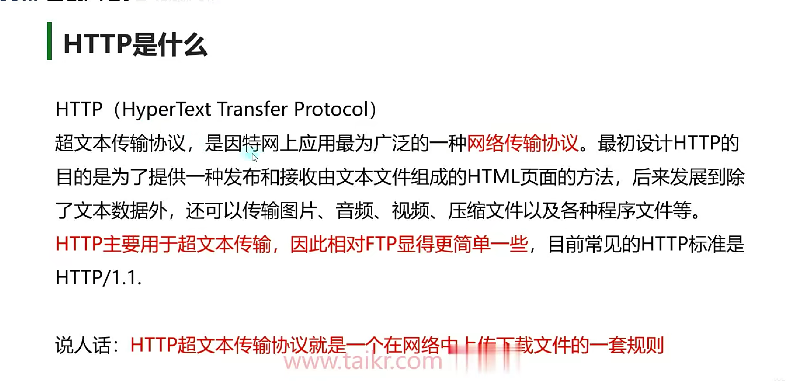

由Socket已经封装好了


# 分包黏包


# IP地址和端口类

## 1.IPAddress

初始化IP信息的方式 

```c#
//1.用byte数组进行初始化
byte[] ipAddress = new byte[4] { 192, 168, 1, 1 };
IPAddress iP1 = new IPAddress(ipAddress);   //声明一个IP地址对象

//2.用long长整型进行初始化
//4字节对应的长整型 一般不建议大家使用
IPAddress ip2 = new IPAddress(0x76666F0B);

//3.推荐使用的方式 使用字符串转换
IPAddress ip3 = IPAddress.Parse("192.168.1.1");

//特殊IP地址
//127.0.0.1代表本机地址

//一些静态成员
//获取可用的IPv6地址
//IPAddress.IPv6Any
```

## 2.IPEndPoint

IPEndPoint类将网络端点表示为IP地址和端口号 表现为IP地址和端口号的组合 

```c#
//初始化方法
IPEndPoint iPEndPoint1 = new IPEndPoint(IPAddress.Parse("192.168.1.1"), 8080);
IPEndPoint iPEndPoint2 = new IPEndPoint(0x76666F0B, 8080);
```

# 域名解析

## 1.IPHostEntry类

命名空间:System.Net

类名:IPHostEntry

主要作用:域名解析后的返回值 可以通过该对象获取IP地址、主机名等等信息

该类不会自己声明，都是作为某些方法的返回值返回信息，我们主要通过该类对象获取返回的信息


获取关联IP          成员变量:AddressList   一个域名可能会对应多个IP地址

获取主机别名列表     成员变量:Aliases         一个域名可能对应多个别名

获取DNS名称         成员变量:HostName      该域名对应的DNS名称

## 2.Dns类

命名空间:System.Net

类名:Dns

主要作用:Dns是一个静态类  提供了很多静态方法，可以使用它来根据域名获取IP地址

```c#
//常用方法
//1.获取本地系统的主机名
print(Dns.GetHostName());

//2.获取指定域名的IP信息
//根据域名获取
//同步获取
//注意:由于获取远程主机信息是需要进行网路通信，所以可能会阻塞主线程
IPHostEntry entry =  Dns.GetHostEntry("www.baidu.com");
for(int i = 0; i < entry.AddressList.Length; i++)
{
	print("IP地址:" + entry.AddressList[i]);
}
for(int i = 0; i < entry.Aliases.Length; i++)
{
	print("别名:" + entry.Aliases[i]);
}
print("DNS名称:" + entry.HostName);

异步获取
GetHostEntry();

异步方法:
private async void GetHostEntry()
    {
        Task<IPHostEntry> task = Dns.GetHostEntryAsync("www.baidu.com");
        await task;

        for(int i = 0; i < task.Result.AddressList.Length; i++)
        {
            print("IP地址:" + task.Result.AddressList[i]);
        }
        for(int i = 0; i < task.Result.Aliases.Length; i++)
        {
            print("别名:" + task.Result.Aliases[i]);
        }
        print("DNS名称:" + task.Result.HostName);
    }
```

# 序列化与反序列化

网络通信中我们不能直接使用数据持久化2进制知识点中的

BinaryFormatter 2进制格式化类

因为客户端和服务器使用的语言可能不一样，BinaryFormatter是c#的序列化规则，和其它语言之间的兼容性不好

如果使用它，那么其它语言开发的服务器无法对其进行反序列化

我们需要自己来处理将类对象数据序列化为字节数组

[序列化的基类](./Code/BaseData.cs)

# Socket重要API

## Socket套接字

它是C#提供给我们用于网络通信的一个类(在其它语言当中也有对应的socket类)

套接字是支持TCP/IP网络通信的基本操作单位

### 一个套接字对象包含以下关键信息

1.本机的IP地址和端口

2.对方主机的IP地址和端口

3.双方通信的协议信息


一个socket对象表示一个本地或者远程套接字信息

它可以被视为一个数据通道

这个通道连接与客户端和服务端之间

数据的发送和接受均通过这个通道进行

 

一般在制作长连接游戏时，我们会使用socket套接字作为我们的通信方案

我们通过它连接客户端和服务端，通过它来收发消息

你可以把它抽象的想象成一根管子，插在客户端和服务端应用程序上，通过这个管子来传递交换信息

## Socket类型

Socket套接字有3种不同的类型

1.流套接字

主要用于实现TCP通信，提供了面向连接、可靠的、有序的、数据无差错且无重复的数据传输服务

2.数据报套接字

主要用于实现UDP通信，提供了无连接的通信服务，数据包的长度不能大于32KB，不提供正确性检查，不保证顺序，可能出现重发、丢失等情况

3.原始套接字(不常用，不深入讲解)

主要用于实现IP数据包通信，用于直接访问协议的较低层，常用于侦听和分析数据包

```c#
//通过Socket的构造函数 我们可以申明不同类型的套接字
//Socket s = new Socket(AddressFamily.InterNetwork,SocketType.Stream, ProtocolType.Tcp);
//参数一:AddressFamily 网络寻址(枚举类型)，决定寻址方案
//常用:
//1.InterNetwork IPv4寻址
//2.InterNetwork6 IPv6寻址
//3.Unix  Unix域套接字寻址   等等  --不常用
//参数二:SocketType 套接字类型(枚举类型)，决定套接字的类型
//常用:
//1.Dgram       最大长度固定的无连接、不可靠的消息(主要用于UDP通信)
//2 .Stream     支持数据报支持可靠、双向、基于连接的字节流(主要用于TCP通信)    
// 参数三:ProtocolType 协议类型(枚举类型)，决定套接字使用的协议
//常用:
//1.TCP     TCP传输控制协议
//2.UDP     UDP用户数据报协议
//其他做了解

//3参数的常用搭配:
//SocketType.Dgram + ProtocolType.Udp  = UDP协议通信 (常用，主要学习)
Socket sU = new Socket(AddressFamily.InterNetwork, SocketType.Dgram, ProtocolType.Udp);
//SocketType.Stream + ProtocolType.Tcp = TCP协议通信 (常用，主要学习)
Socket sT = new Socket(AddressFamily.InterNetwork, SocketType.Stream, ProtocolType.Tcp);
//SocketType.Raw + ProtocolType.Icmp  = Internet控制报文协议(做了解)
//SocketType.Raw + ProtocolType.Raw  = 简单的IP包通信(做了解)
```

## 常用属性和方法

```csharp
//属性
//1.套接字的连接状态
print(sT.Connected);
//2.获取套接字的类型
print(sT.SocketType);
//3.获取套接字的协议类型
print(sT.ProtocolType);
//4.获取套接字的寻址方案
print(sT.AddressFamily);
//5.从网络中获取准备读取的数据数据量
print(sT.Available);
//6.获取本机EndPoint对象(注意:IPEndPoint继承EndPoint)
print(sT.LocalEndPoint as IPEndPoint);
//7.获取远程EndPoint对象
print(sT.RemoteEndPoint as IPEndPoint);

//方法
//1.主要用于服务器
// 1-1:绑定IP和端口号
IPEndPoint point = new IPEndPoint(IPAddress.Parse("127.0.0.1"), 8080);
sT.Bind(point); //绑定IP和端口号

// 1-2:设置客户端连接的最大数量
sT.Listen(10);  //  最多10个客户端连接
// 1-3:等待客户端连入
sT.Accept(); //阻塞式等待客户端连接  存在异步方法

//2.主要用于客户端
//1-1:连接远程服务端
sT.Connect(point);  //传入ip和端口
        
//3.客户端服务端都会用的
//1-1:同步发送和接收数据
sT.Send(new byte[1024]);   //发送数据
sT.Receive(new byte[1024]);  //接收数据
//1-2:异步发送和接收数据
//1-3:释放连接并关闭socket，先与close调用
sT.Shutdown(SocketShutdown.Both); //关闭连接，释放所有socket关联资源
//1-4:关闭连接，释放所有socket关联资源
sT.Close();
```

# unity客户端

## 流程

1.创建套接字socket

2.用connect方法与服务端相连

3.用send和Receive日关方法收发数据

4.用shutdown方法释放连接

5.关闭套接字

## 总结：

1.客户端连接的流程每次都是相同的

2.客户端的 Connect、send、Receive是会阻塞主线程的 ,要等到执行完毕才会继续执行后面的内容

## 具体代码

[NetMgr](./Code/NetMgr.cs)

# 区分消息


# UDP


# FTP


# HTTP




