# 1.

## 网络的作用

网络是由若干设备和连接这些设备的链路构成

各种设备 间接或者直接通过介质相连

设备之间想要进行信息传递时

**将想要传递的数据编码为2进制数值便可以被有效的传输**

这些数据是以电脉冲的形式进行传输的

线缆中的电压是在高低状态之间进行变化的因而
二进制中1是通过产生一个正电压来传输的
二进制中0是通过产生一个负电压来传输的

## 概念:

1.网络:由若干设备和连接道文些设备的链路构成，设备间可以相互通信

2.局域网:指某一个小区域内由多台设备互联成的计算机组

3.以太网:网络连接的一种规则，定义了连接传输规范

4.城域网:是在一个城市范围内所建立的网络，几十到一百公里

5.广域网:是连接不同地区、城市、国家的远程网络，几十到几千公里

6.互联网(因特网):是目前国际上最大的互联网，定义了通信规则等

7.万维网:是基于因特网的站和网页的统称

# 2.

## IP地址

1.基本概念:IP地址(Internet Protocol Address)是指互联网协议地址，又译为网际协议地址  ， IP地址是IP协议提供的一种统一的地址格式，IP地址是设备在网络中的具体地址

2.分类:IPV4和IPV6

IPV4:0.0.0.0~255.255.255.255  五类:A,B,C,D,E

IPV6:0.0.0.0.0.0~65535.65535.65535.65535.65535.65535

# 3.

对于网络游戏开发来说

我们采用C/S模型来进行前后端开发

在服务端的布局上往往使用的是
分布式的形式进行管理

比如服务端的用户数据使用集中式进行管理    

玩家的数据都存储在数据库应用(SQLServer、MySQL)中   （集中）

服务端应用程序使用分布式进行管理账号服务器、游戏服务器、聊天服务器、跨服PVP服务器等分布式管理  (分散压力  体现分散)

这些服务端应用程序都使用数据库中的数据分别进行逻辑处理

# 4.

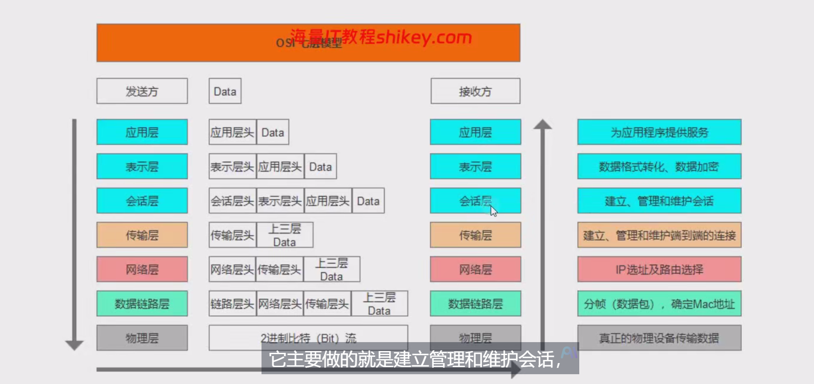

OSI模型是网络通信的基本规则

TCP/IP协议是基于OSI模型的工业实现

# 5.

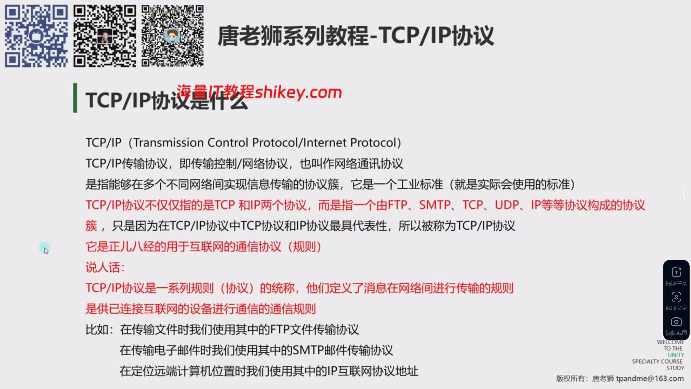

## TCP/lP(Transmission Control Protocol/Internet Protocol)

TCP/IP传输协议，即传输控制/网络协议，也叫作网络通讯协议

是指能够在多个不同网络间实现信息传输的协议簇，它是一个工业标准(就是实际会使用的标准)

TCP/IP协议不仅仅指的是TCP 和IP两个协议，而是指一个由FTP、SMTP、TCP、UDP、IP等等协议构成的协议簇，只是因为在TCP/IP协议中TCP协议和IP协议最具代表性，所以被称为TCP/IP协议

它是正儿八经的用于互联网的通信协议(规则)

说人话:
TCP/IP协议是一系列规则(协议)的统称，他们定义了消息在网络间进行传输的规则

是供已连接互联网的设备进行通信的通信规则

比如:在传输文件时我们使用其中的FTP文件传输协议
在传输电子邮件时我们使用其中的SMTP邮件传输协议
在定位远端计算机位置时我们使用其中的IP互联网协议地址

OSI是一个概念,TCP/IP是基于这个概念的具体实现

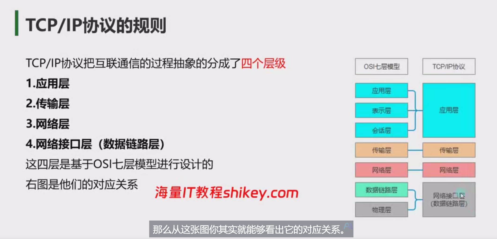

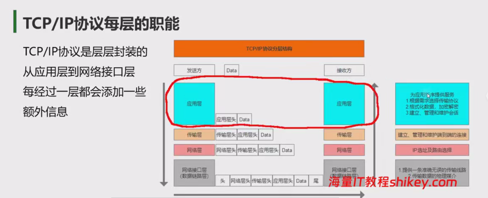

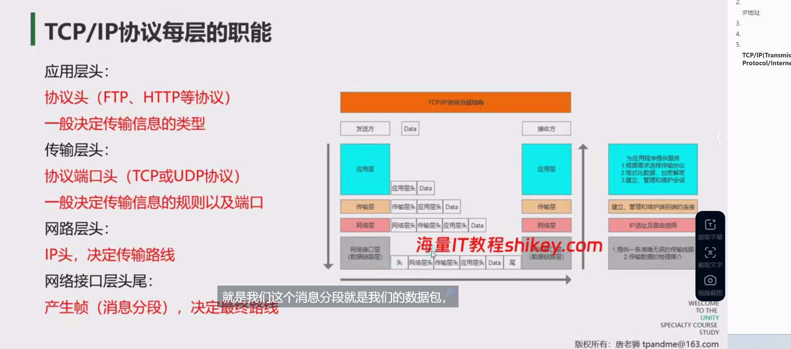

# 6.TCP和UDP

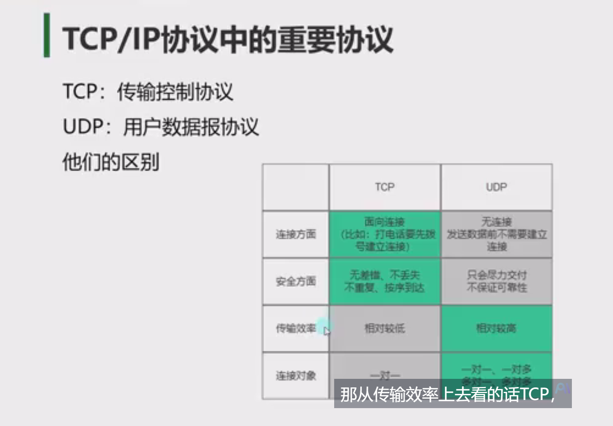

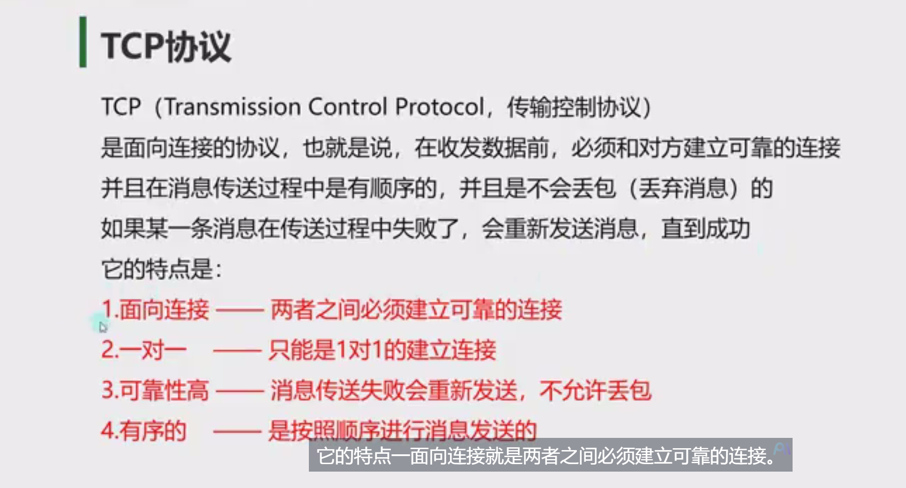

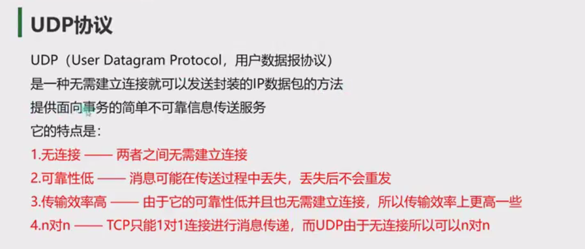

# 7.网络通信方案

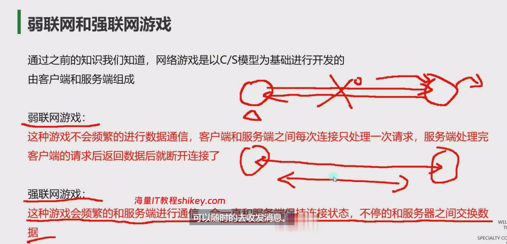

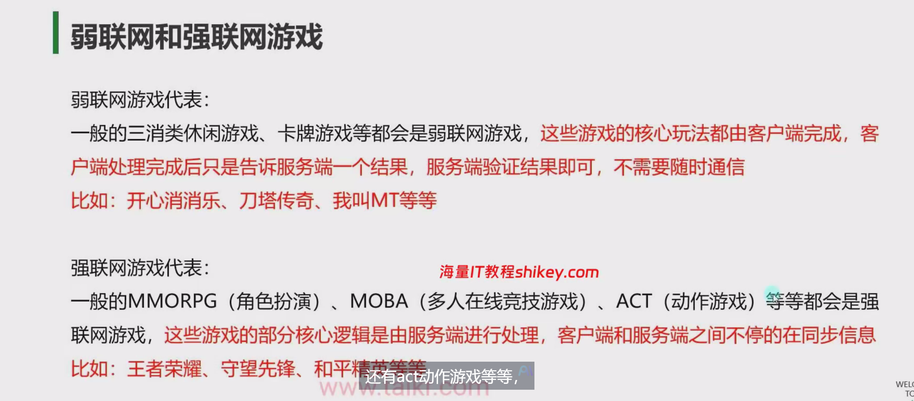

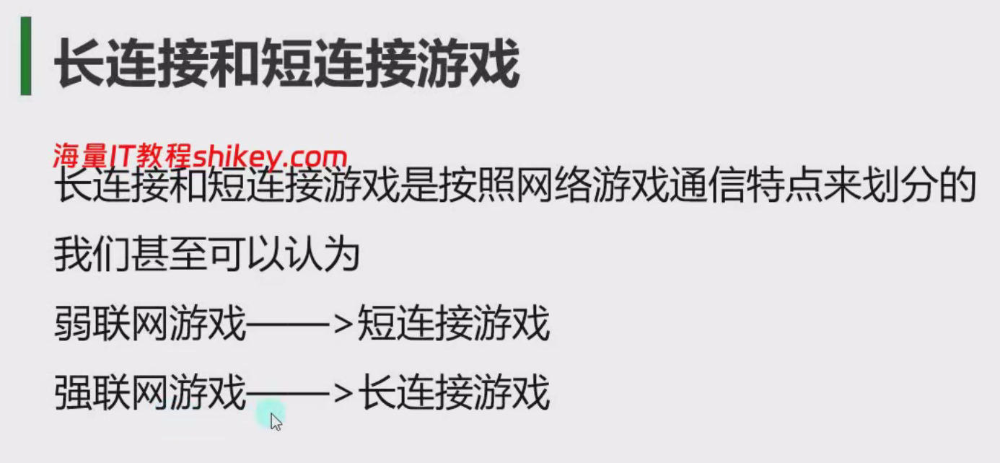

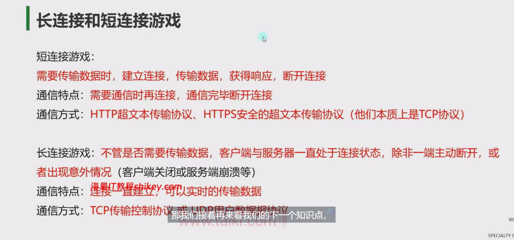

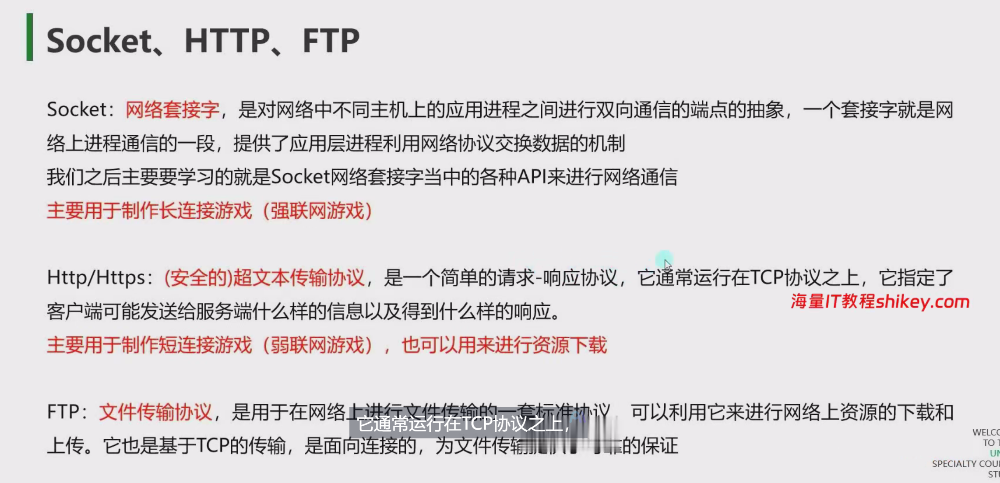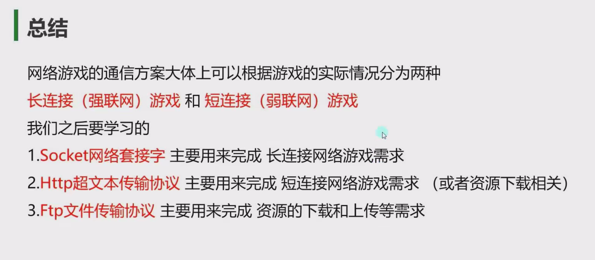

# 8.三次握手四次挥手

## (1)三次握手

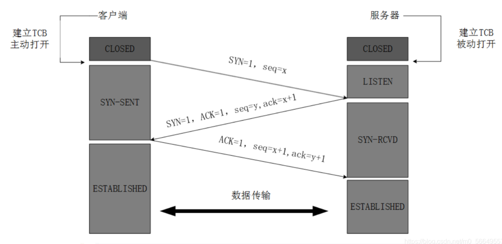

第一次握手 TCP客户进程也是先创建传输控制块TCB，然后向服务器发出连接请求报文，这是报文首部中的同部位SYN=1，同时选择一个初始序列号 seq=x ，此时，TCP客户端进程进入了 SYN-SENT 同步已发送状态

第二次握手 TCP服务器收到请求报文后，如果同意连接，则会向客户端发出确认报文。确认报文中应该 ACK=1，SYN=1，确认号是ack=x+1，同时也要为自己初始化一个序列号 seq=y，此时，TCP服务器进程进入了 SYN-RCVD 同步收到状态

第三次握手 TCP客户端收到确认后，还要向服务器给出确认。确认报文的ACK=1，ack=y+1，自己的序列号seq=x+1，此时，TCP连接建立，客户端进入ESTABLISHED已建立连接状态 触发三次握手

有人可能会很疑惑为什么要进行第三次握手？
主要原因：防止已经失效的连接请求报文突然又传送到了服务器，从而产生错误

第一次握手： 客户端向服务器端发送报文
证明客户端的发送能力正常
第二次握手：服务器端接收到报文并向客户端发送报文
证明服务器端的接收能力、发送能力正常
第三次握手：客户端向服务器发送报文
证明客户端的接收能力正常

## (2)四次挥手

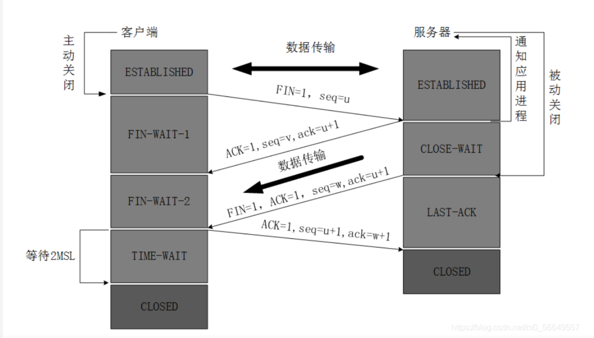第一次挥手 客户端发出连接释放报文，并且停止发送数据。释放数据报文首部，FIN=1，其序列号为seq=u（等于前面已经传送过来的数据的最后一个字节的序号加1），此时，客户端进入FIN-WAIT-1（终止等待1）状态

第二次挥手 服务器端接收到连接释放报文后，发出确认报文，ACK=1，ack=u+1，并且带上自己的序列号seq=v，此时，服务端就进入了CLOSE-WAIT 关闭等待状态

第三次挥手 客户端接收到服务器端的确认请求后，客户端就会进入FIN-WAIT-2（终止等待2）状态，等待服务器发送连接释放报文，服务器将最后的数据发送完毕后，就向客户端发送连接释放报文，服务器就进入了LAST-ACK（最后确认）状态，等待客户端的确认。

第四次挥手 客户端收到服务器的连接释放报文后，必须发出确认，ACK=1，ack=w+1，而自己的序列号是seq=u+1，此时，客户端就进入了TIME-WAIT（时间等待）状态，但此时TCP连接还未终止，必须要经过2MSL后（最长报文寿命），当客户端撤销相应的TCB后，客户端才会进入CLOSED关闭状态，服务器端接收到确认报文后，会立即进入CLOSED关闭状态，到这里TCP连接就断开了，四次挥手完成

为什么客户端要等待2MSL？
主要原因是为了保证客户端发送那个的第一个ACK报文能到到服务器，因为这个ACK报文可能丢失，并且2MSL是任何报文在网络上存在的最长时间，超过这个时间报文将被丢弃，这样新的连接中不会出现旧连接的请求报文。

