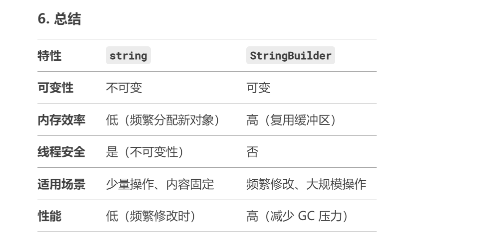
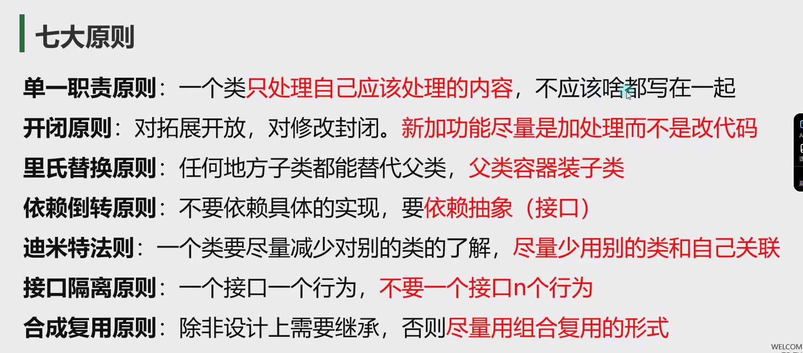

# 基础篇

## 1.枚举

### 枚举是什么?

是一个被命名的整型常量的集合 一般用来表示 状态 类型等等

### 在哪声明枚举

1.namespace语句块中(常用)      2.class语句块中 struct语句块中
注意:枚举不能声明在函数语句块中

### 枚举的使用

可在动画状态机中使用

#### 1.枚举的申明

```C#
//枚举名 以E或者E_开头(命名规范)
/*enum E_自定义枚举名
{
    自定义枚举项名字,   //枚举中包裹的 整型常量 第一个默认值是0 下面依次累加  也可以赋值
    自定义枚举项名字1,
    自定义枚举项名字2,

}*/
```

 **==注意==**:第一个默认值是0 下面依次累加  也可以赋值

#### 2.配合Switch使用

```C#
E_MonsterType monsterType = E_MonsterType.Normal;
            switch(monsterType)
                {
                    case E_MonsterType.Normal:
                    Console.WriteLine("普通怪");
                    break;
                    case E_MonsterType.Boss:
                    Console.WriteLine("boss怪");
                    break;
                }
```

#### 3.枚举的类型转换

```C#
//枚举和int互转
int i = (int)monsterType; //枚举转int
monsterType = (E_MonsterType)1;    //int转枚举
Console.WriteLine(i);


//枚举和string互转
string str = monsterType.ToString();
Console.WriteLine(str);

//把string 转换成枚举
//Parse后 第一个参数 :你要转为的是哪个 枚举类型 第二个参数:用于转换的对应枚举项的字符串
//转换完毕后 是一个通用的类型 我们需要用括号强转成我们想要的目标枚举类型
monsterType = (E_MonsterType)Enum.Parse(typeof(E_MonsterType),"Normal");
```

# 核心篇

## 1.变长参数和默认参数

### 可变参数(params)

一个函数只能有一个写在最后  后跟一个数组用来传递数据

```C#
static void add( params int[] a)
{
    int sum = 0;
    foreach (int i in a)
    {
        sum += i;
    }
    Console.WriteLine(sum);
}
```

### 默认参数

写在最后 可以有多个

```C#
static void print(string a = "hello",string b = "world")
{
    Console.WriteLine(a + " " + b);
}
```

## 2.成员属性

**自动属性**

使用"=>"来快速定义只读属性

 **注意**

1.默认不加 会使用属性申明时的访问权限
2.加的访问修饰符要低于属性的访问权限
3.不能让get和set的访问权限都低于属性的权限

## 3.索引器

 **主要作用**

可以让我们以中括号的形式访问自定义类中的元素 规则自己定 访问时和数组一样

比较适用于 在类中有数组变量时使用 可以方便的访问和进行逻辑处理

 **固定写法**

```C#
访问修饰符 返回值 this[参数列表]
get和set语句块
可以重载
注意:结构体里面也是支持索引器
public int this[int x, int y]
{
    get
    {
        return array[x, y];
    }
    set
    {
        if (array == null)
        {
            array = new int[x+1, y+1];
        }
        array[x, y] = value;
    }
}
```

 [索引器](F:\桌面\知识库整理\语言知识\CSharp.assets\索引器.cs)

## 4.静态成员

### 静态成员的特点

1.程序开始运行时 就会分配内存空间。所以我们就能直接使用,

2.静态成员和程序同生共死

只要使用了它，直到程序结束时内存空间才会被释放

所以一个静态成员就会有自己唯一的一个“内存小房间”

这让静态成员就有了唯一性

在任何地方使用都是用的小房间里的内容，改变了它也是改变小房间里的内容.

### 静态函数中不能使用非静态成员（会报错）

非静态函数可以使用静态成员                    ---->生命周期的影响   静态的开始时就存在  不需要实例化

### 常量和静态

const(常量)可以理解为特殊的static(静态)

**相同点**

他们都可以通过类名点出使用

**不同点**

1.const必须初始化，不能修改    static没有这个规则

2.const只能修饰变量、static可以修饰很多

3.const一定是写在访问修饰符后面的，static没有这个要求

## 5.静态类和静态构造函数

**静态类** ： static修饰的类只能包含静态成员  不能实例化

### 静态构造函数:

在构造函数加上static  

**特点**：

普通类和静态类都可以拥有

不能使用访问修饰符

不能有参数

只会调用一次

**作用**:在静态构造函数中初始化 静态变量

**生命周期**：静态构造函数无论是在静态类中还是在普通类中都只在类第一次使用的时候调用一次

## 6.拓展方法

**概念**:
为现有非静态 变量类型 添加 新方法
**作用**
1.提升程序拓展性
2.不需要再对象中重新写方法
3.不需要继承来添加方法
4.为别人封装的类型写额外的方法
**特点**
1.一定是写在静态类中
2.一定是个静态函数
3.第一个参数为拓展目标
4.第一个参数用this修饰

```C#
public static void Print(this string str)   //为string添加拓展方法  string无法更改 在任意一个静态类中添加拓展方法
//如果拓展方法的方法名和原类中的方法名一样执行原来类中的方法
{
 Console.WriteLine("这是拓展方法");
}
```

## 7.运算符重载

**概念**
让自定义类和结构体能够使用运算符
使用关键字 operator
**特点**
1.一定是一个公共的静态方法
2.返回值写在operator前
3.逻辑处理自定义
**作用**
让自定义类和结构体对象可以进行运算
**注意**
1.条件运算符需要成对实现
2.一个符号可以多个重载
3.不能使用ref和out

```C#
class Point
{
    public int x;
    public int y;
    public static Point operator + (Point a, Point b)  //必须有一个是包含的类(例中是Point)
    {
        Point p = new Point();
        p.x = a.x + b.x;
        p.y = a.y + b.y;
        return p;
    }
    public Point(int x, int y)
    {
        this.x = x;
        this.y = y;
    }
    Point ()
    {
        x = 0;
        y = 0;
    }
}
```

## 8.继承

**1.继承的特点**:  单根性  和  传递性

2.子类和父类同名的成员和函数

隐藏父类成员和函数   省略了new关键字-----覆盖父类的方法

3.**继承中的构造函数**

   (1).子类实例化时 默认自动调用的 是父类的无参构造 所以如果父类无参构造被顶掉 会报错

可以通过base来调用父类重载的其他构造函数      但是父类一定要有子类相同的构造函数

## 9.抽象类

### 1.抽象类

#### 概念：

被抽象关键字abstract修饰的类

#### 特点：

1.不能被实例化
2.可以包含抽象方法
3.继承抽象类必须重写抽象方法

### 2.抽象方法

#### 概念:

又叫 纯虚方法  用 abstract关键字修饰的方法

#### 特点:

1.只能在抽象类中申明
2.没有方法体
3.不能是私有的    要能够被子类重写---可以是public 和 protected
4.继承后必须实现 用override重写

## 10.接口

1.**接口申明的规范**
(1).不包含成员变量
(2).只包含方法、属性、索引器、事件
(3).成员不能被实现
(4).成员可以不用写访问修饰符，不能是私有的   默认为 public
(5).接口不能继承类，但是可以继承另一个接口

2.**特点**:
(1).它和类的申明类似
(2).接口是用来继承的
(3).接口不能被实例化，但是可以作为容器存储对象

3.**接口的使用**
接口用来继承       接口表示行为的关系

(1).类可以继承1个类，n个接口
(2).继承了接口后 必须实现其中的内容 并且必须是public的
(3).实现的接口函数，可以加virtual再在子类重写
(4).接口也遵循里氏替换原则
4.**接口可以继承接口**
接口继承接口时   不需要实现
待类继承接口后   类自己去实现所有内容   实现该接口，该接口父亲接口的所有内容

5.**显示实现接口**
当一个类继承两个接口
但是接口中存在着同名方法时
注意:显示实现接口时 不能写访问修饰符

```C#
//显示的实现接口,分别实现  使用的时候要注意确定使用的函数是哪个接口
void I3.Fly()
{
    throw new NotImplementedException();
}
void I2.Fly()
{
    throw new NotImplementedException();
}
public void Fly()  //已显示实现接口，此时的Fly为类自己的FLy  可以通过；类实例化的对象.Fly()调用
{

}
```

## 11.string和StringBulider

 

## 12.抽象类和接口的区别

1.**相同点**：

1.都可以被继承	2.都不能直接实例化	3.都可以包含方法申明!		4.子类必须实现未实现的方法	5.都遵循里氏替换原则

2.**区别**：

1.抽象类中可以有构造函数;接口中不能  	2.抽象类只能被单一继承;接口可以被继承多个 		3.抽象类中可以有成员变量:接口不能	4.抽象类中可以申明成员方法，虚方法，抽象方法，静态方法;接口中只能申明没有实现的抽象方法		5.抽象类方法可以使用访问修饰符:接口中建议不写，默认public

3.**如何选择抽象类和接口**

表示对象的用抽象类，表示行为拓展的用接口															不同对象拥有的共同行为，我们往往可以使用接口来实现													举个例子:
动物是一类对象，我们自然会选择抽象类;而飞翔是一个行为，我们自然会选择接口

## 13.结构体和类的区别

**关键区别**

(1)结构体和类最大的区别是在存储空间上，结构体存储在栈上，类存储在堆上。一个是值类型，一个是引用类型。
(2)分别对应值类型和引用类型的相应特点  赋值,传递,声明.. 
(3)结构体和类在使用上很类似,结构体甚至可以用面向对象的思想去总结一类对象
(4)结构体具备面向对象思想中的封装特性，但是不具备其他特性
(5)由于结构体不具备继承特性，所以它不能使用protected 修饰符

**区别细节**

(1).结构体是值类型，类是引用类型
(2).结构体存在栈中，类存在堆中
(3).结构体成员不能使用protected访问修饰符，而类可以
(4).结构体成员变量申明不能指定初始值，而类可以   如果结构体成变量声明时候进行了初始化，会报错，如果实现了结构体的构造函数就不错了
(6).结构体申明有参构造函数后，无参构造不会被顶掉
(7).结构体不能申明析构函数，而类可以
(8).结构体不能被继承，而类可以
(9).结构体需要在构造函数中初始化所有成员变量，而类随意
(10).结构体不能被静态static修饰(不存在静态结构体)，而类可以   结构体中可以有静态static成员变量
(11).结构体不能在自己内部申明和自己一样的结构体变量，而类可以

**如何选择**

(1).想要用继承和多态时，直接淘汰结构体，比如玩家、怪物等等
(2).对象是数据集合时，优先考虑结构体，比如位置、坐标等等
(3).从值类型和引用类型赋值时的区别上去考虑，比如经常被赋值传递的对象，并且
改变赋值对象，原对象不想跟着变化时，就用结构体。比如坐标、向量、旋转等等

**结构体的特别之处**

结构体可以继承接口   因为接口是行为的抽象

**面相对象的七大原则**:



# 注意事项:

1.在一个类中不能实例化一个与自身相同的对象  如果要声明也不能实例化(类似递归了)

# 进阶篇

## 1.栈

**本质**：

是一个C#封装好的类       本质是一个object[]数组  只是封装了特殊的存储规则           先进后出FILO4

## 2.队列

**本质**：

本质也是一个object[]数组  只是封装了特殊的规则  FIFO

## 3.哈希表

**与字典的区别**

字典查找值时候找不到会报错    哈希表不会(返回一个null)

**增删查改**

```C#
#region 增删查改
//增   不要出现相同的键
ht.Add(1, 13);

/删
//1.只能通过键删除
ht.Remove(1);
//2.删除不存在的元素  没反应
ht.Remove(100);
//3.直接清空
ht.Clear();

//查   
//1.通过键去查   查不到返回空
Console.WriteLine(ht[1]);
Console.WriteLine(ht["age"]);
//2.查看是否存在	----键和值都可以查存在
    //根据键检测 
    ht.ContainsKey(1);
//根据值检测
ht.ContainsValue("张三");

//改 
//只能改键对应的值 无法修改键
ht[1] = true;
#endregion

#region 遍历
//1.Hashtable.Count 得到键值对数目

//遍历所有键
foreach (object item in ht.Keys)
{
    Console.WriteLine("键"+item);
    Console.WriteLine("值：" + ht[item]);
}

//遍历所有值
foreach (object item in ht.Values)
{
    Console.WriteLine("值" + item);  //无法通过值获取键
}

//遍历所有键值对
foreach (DictionaryEntry item in ht)
{
    Console.WriteLine("键值对" + item);
}

//迭代器遍历
IDictionaryEnumerator myEnumerator =  ht.GetEnumerator();
bool flag = myEnumerator.MoveNext();
while(flag)
{
    Console.WriteLine("键 "+myEnumerator.Key+"值 " + myEnumerator.Value);
    flag  = myEnumerator.MoveNext();
}
#endregion
```

## 4.泛型约束

**1.什么是泛型约束**

让泛型的类型有一定的限制
关键字:where
泛型约束一共有6种
1.值类型                               where 泛型字母:struct
2.引用类型                             where 泛型字母 : class
3.存在无参公共构造函数                  where 泛型字母:new () 
4.某个类本身或者其派生类                where  泛型字母:类名
5.某个接口的派生类型                    where 泛型字母:接口名
6.另一个泛型类型本身或者派生类型         where 泛型字母:另一个泛型字母

**2.各种泛型约束**

(1).值类型

传入类型是值类型                       

(2).引用类型

传入类型是引用类型

(3).存在无参公共构造函数

传入的类型存在无参公共构造函数

注意:结构体有无参数构造函数(默认生成)   进行构造函数重载时也不会替换原有的无参构造函数  结构体中的无参数构造函数必须为public  所以满足了所有条件 

抽象类  即使有无参数公共构造函数也能不能使用 不能new

(4).某个类本身或者其派生类

传入的类型是泛型约束限制的类或者该类的派生类           

(5).某个接口的派生类型

传入的类型是限制的接口，实现该接口的类，继承该接口的接口，实现接口派生接口的类

(6).另一个泛型类型本身或者派生类型

```C#
class Test6<T,U> where T : U  //T是U本身  T是U的派生类 T实现了U的接口
{
    public T a;
    public void testFunc<K,V>(K a) where K : V
    {
        Console.WriteLine(a);
    }
}
```

## 5.委托

**1.委托是什么**

委托是 函数(方法)的容器
可以理解为表示函数(方法)的变量类型
用来 存储、传递函数(方法)
委托的本质是一个类，用来定义函数(方法)的类型(返回值和参数的类型)
不同的 函数(方法)必须对应和各自"格式"一致的委托

==委托不存在重载 不能重名==

**2.多播传播**

+=     ---- 添加函数(添加多个有返回值的函数时,调用该委托返回的是最后一个函数的返回值)               

-=      ----去除函数    ==多减不报错   找不到就不操作==

**3.系统定义的委托**

Action  无参数无返回值
Func<T>  可以指定返回类型的泛型委托
Action <T1,T2,...,T16>   可以传n个参数的泛型委托   1-16个参数的委托  

Func<T1,T2,T3..T16>  传n个参数,一个返回值，0-15个输入参数

## 6.事件

**1.事件相对于委托的区别:**

(1).不能在类外部 赋值

(2).不能再类外部 调用

注意:

它只能作为成员存在于类和接口以及结构体中

**2.为什么使用事件**

(1).防止外部随意置空委托

(2).防止外部随意调用委托

(3).事件相当于对委托进行了一次封装 让其更加安全

## 7.闭包

**1.什么是闭包**

内层的函数可以引用包含在它外层的函数的变量
即使外层函数的执行已经终止       可以在一定范围保存变量的值，但又没有全局那么大，仅在当前函数范围内使用保存。
注意:
该变量提供的值并非变量创建时的值，而是在父函数范围内的最终值,

闭包结构：C#内部将变量捕获，创建一个类来处理这个变量

## 8.List排序

**1.自定义类的排序**

(1)在类中实现IComparable<T>接口, 实现CompareTo方法

```C#
class Item : IComparable<Item>
{
    public int money;

    public Item(int money)
    {
        this.money = money;
    }

    public int CompareTo(Item? other)
    {
        //小于0 放在传入对象的前面
        //等于0 保持当前位置不变
        //大于0 放在传入对象的后面

        //可以简单理解 传入对象的位置 就是θ
        //如果你的返回为负数 就放在它的左边 也就前面
        //如果你返回正数 就放在它的右边 也就是后面

        if(this.money < other.money)
            return -1;
        else if(this.money > other.money)
            return 1;
        else
            return 0;
     }
}
```

(2) 通过传入函数(委托)

```C#
list.Sort((a, b) => { return b.id - a.id; });     //也可以传入一个函数
```

## 9.协变逆变

**1.什么是协变逆变**

==协变==:

和谐的变化，自然的变化

因为 里氏替换原则 父类可以装子类

所以 子类变父类

比如 string 变成 object

感受是和谐的

==逆变==:

逆常规的变化，不正常的变化

因为 里氏替换原则 父类可以装子类 但是子类不能装父类

所以 父类变子类

比如 object 变成 string

感受是不和谐的

==协变和逆变是用来修饰泛型的==

协变:out

逆变:in

用于在泛型中 修饰 泛型字母的

只有泛型接口和泛型委托能使用

**2.使用案例**

```C#
//1.返回值 和 参数
//用 out修饰的泛型  只能作为返回值
delegate T TestOut <out T>();
//用 in修饰的泛型  只能作为参数
delegate void TestIn <in T>(T t);
class Father
{ }
class Son : Father
{ }
internal class Program
{
    static void Main(string[] args)
    {
        #region 知识点二 作用 （结合里氏替换原则理解）
        //协变  父类总是能被子类替换
        TestOut<Son> os = () =>{ return new Son(); };
        TestOut<Father> of = os;
        Father f = of();  //实际上  返回的 是os里装的函数  返回的是 Son
        
        //逆变  父类总是能被子类替换
        TestIn<Father> iF = (value) => { };   //iF是  TestIn<Father>类型的
        TestIn<Son> iS = iF;      //iS是TestIn<Son>  却装载了iF   子类装父类
        iS(new Son());  //实际上 调用的是 iF
        #endregion
    }
}
```

**3.不变性（Invariance）**

如果没有使用in或out关键字，则该泛型类型就是不变的（Invariant）。对于不变的泛型类型，只能使用确切定义时使用的类型，不能进行协变或逆变。

例如，List<T>是一个不变的类型，因此你不能将List<string>赋值给List<object>变量，反之亦然。

这些特性使得C#中的泛型更加灵活和强大，但同时也需要开发者小心处理以避免潜在的类型安全问题。理解协变、逆变以及何时应用它们对于编写高效且安全的代码至关重要。

## 10.多线程

**1.多线程语法**

```C#
//线程类 Thread 
//1.申明一个新的线程
//注意 线程执行的代码需要封装到一个函数中
//新线程 将要执行的代码封装到一个函数中    
Thread t = new Thread(new ThreadStart(test));   

//2.开启线程
t.Start();

//3.设置为后台线程
//当前台线程都结束了的时候,整个程序也就结束了,即使还有后台线程正在运行
//后台线程不会防止应用程序的进程被终止掉
//如果不设置为后台线程 可能导致进程无法正常关闭
//t.IsBackground = true;  //如果设置为后台线程,则当前进程结束后,后台线程也会结束

//4.关闭释放一个线程
//如果开启的线程中不是死循环 是能够结束的逻辑 那么 不用刻意的去关闭它
//如果是死循环 想要中止这个线程 有两种方式
//4.1   死循环改为使用 bool标识
//4.2通过线程提供的方法(注意在.net core版本中无法中止 会报错)
//终止线程
//t.Abort();

//5.线程休眠
//让线程休眠多少毫秒
//在哪个线程里执行  就休眠哪个线程
// Thread.Sleep(1000);

```

## 11.编译预处理指令

**1.常见的预处理器指令**

==(1).#define和#undef==

#define

定义一个符号，类似一个没有值的变量

#undef

取消define定义的符号，让其失效

两者都是写在脚本文件最前面

一般配合 if指令使用 或配合特性

==(2).条件分支==

#if

#else if

#else

#endif

和if语句规则一样

一般配合#define定义的符号使用

用于告诉编译器进行编译代码的流程控制

    #if unity &&CSharp //如果发现unity这个符号定义了   那么就执行下面的代码
                Console.WriteLine("unity & C#");
    #endif

==(3).警告和错误==

#warning

#error

告诉编译器

是报警告还是报错误

一般还是配合if使用

## 12.反射

**1.概念**

==(1).什么是程序集==

程序集是经由编译器编译得到的，供进一步编译执行的那个中间产物

在WINDOWS系统中，它一般表现为后缀为·dll(库文件)或者是·exe(可执行文件)的格式

说人话:

程序集就是我们写的一个代码集合，我们现在写的所有代码

最终都会被编译器翻译为一个程序集供别人使用

比如一个代码库文件(dll)或者一个可执行文件(exe)

==(2).元数据==

元数据就是用来描述数据的数据

这个概念不仅仅用于程序上，在别的领域也有元数据

说人话:

程序中的类，类中的函数、变量等等信息就是 程序的 元数据

有关程序以及类型的数据被称为 元数据，它们保存在程序集中

==(3).反射的概念==

程序正在运行时，可以查看其它程序集或者自身的元数据。

一个运行的程序查看本身或者其它程序的元数据的行为就叫做反射

说人话:

在程序运行时，通过反射可以得到其它程序集或者自己程序集代码的各种信息

类，函数，变量，对象等等，实例化它们，执行它们，操作它们

**2.Type**

==1.Type(类的信息类)==

它是反射功能的基础!
它是访问元数据的主要方式
使用 Type 的成员获取有关类型声明的信息
有关类型的成员(如构造函数、方法、字段、属性和类的事件)

==2.方法==

1.获取Type    ---结构体和类的Type

```c#
//1.万物之父object中的GetType方法可以获取对象的Type
int  a = 0;
Type type = a.GetType();
Console.WriteLine(type);
            
//2.通过typeof关键字  传入类名 也可以得到对象的Type
Type type1 = typeof(int);
Console.WriteLine(type1);
            
//3.通过类的名字 也可以获取类型 
//注音  类名必须包含命名空间 不然找不到
Type type2 = Type.GetType("System.Int32");
Console.WriteLine(type2);
```

2.得到类的程序集信息

```c#
//可以通过Type得到类型所在的程序集信息
Console.WriteLine(type.Assembly);
Console.WriteLine(type1.Assembly);
Console.WriteLine(type2.Assembly);
```

3.获取类中的所有公共成员

```c#
//首先得到 Type
Type t = typeof(test);
//然后得到所有的公共成员
MemberInfo[] infos = t.GetMembers();
for(int i = 0; i < infos.Length; i++)
{
		Console.WriteLine(infos[i]);
}
```

4.获取类的公共构造函数并调用

```c#
//1.获取所有的构造函数
ConstructorInfo[] cis = t.GetConstructors();
for(int i = 0; i < cis.Length; i++)
{
	Console.WriteLine(cis[i]);
}

//2.获取其中一个构造函数并执行
//得构造函数传入 Type数组 数组中内容按顺序是参数类型
//执行构造函数传入object数组 表示按顺传入的参数

//  2-1得到无参构造
ConstructorInfo info = t.GetConstructor(new Type[0]);
//执行无参构造  无参构造 没有参数 传null
test obj = info.Invoke(null) as test;
Console.WriteLine(obj.j);

// 2-2得到有参构造
ConstructorInfo info2 = t.GetConstructor(new Type[]{typeof(int), typeof(int), typeof(string)});   // i  j str
obj = info2.Invoke(new object[]{1, 2, "hello"}) as test;   // i j str---test中的i j str 
Console.WriteLine(obj.j+" "+obj.str);
```

5.获取类的公共成员变量

```c#
Console.WriteLine();
//1.得到所有的公共成员变量
FieldInfo[] fieldInfos= t.GetFields();
for(int i = 0; i < fieldInfos.Length; i++)
{
	Console.WriteLine(fieldInfos[i]);
}
 
//2.得到指定名称的公共成员变量
FieldInfo infoj = t.GetField("j");
Console.WriteLine(infoj);
            
//3.通过反射获取和设置对象的值
test t1 = new test ();
t1.j = 1;
t1.str = "hello";
//3-1通过反射 获取指定对象的某个变量的值
Console.WriteLine(infoj.GetValue(t1));
//3-2通过反射 设置指定对象的某个变量的值
infoj.SetValue(t1, 2);
Console.WriteLine(infoj.GetValue(t1));
```

6.获取类的公共成员方法

```c#
//通过Type类中的 GetMethod方法 得到类中的方法
            //MethodInfo 是方法的反射信息
            Type strType = typeof(string);
            //1.如果存在方法重载 用Type数组表示参数类型
            MethodInfo[] methodInfos = strType.GetMethods();
            MethodInfo subStr = strType.GetMethod("Substring",new Type[] {typeof(int), typeof(int) });
            string tstring = "adadasdasd";
            object tmp =  subStr.Invoke(tstring, new object[] { 1, 2 });   //tstring执行   返回用超级父类object接收，使用string报错没确定是什么
            Console.WriteLine(tmp);
```

**3.Assembly**

==1.Assembly==

程序集类
主要用来加载其它程序集，加载后
才能用Type来使用其它程序集中的信息
如果想要使用不是自己程序集中的内容 需要先加载程序集
比如 d11文件(库文件)
简单的把库文件看成一种代码仓库，它提供给使用者一些可以直接拿来用的变量、函数或类

==2.三种加载程序集的函数==

1.一般用来加载在同一文件下的其它程序集

```c#
      Assembly asembly2 = Assembly.Load("程序集名称");
```

2.一般用来加载不在同一文件下的其它程序集

```c#
Assembly asembly = Assembly.LoadFrom("包含程序集清单的文件的名称或路径”);
```

3.加载其他文件的程序集

```c#
Assembly asembly3 = Assembly.LoadFile("要加载的文件的完全限定路径");
```

==3具体使用==

```c#
 //1.先加载一个指定的程序集
Assembly asembly = Assembly.LoadFrom("F:\\unity\\TangCourse\\C#\\进阶\\CSharp进阶\\反射加载的数据\\bin\\Debug\\net7.0\\反射加载的数据.dll");
Type[] types = asembly.GetTypes();
for (int i = 0; i < types.Length; i++)
{
	Console.WriteLine(types[i]);
}

//2.再加载程序集中的一个类对象  之后才能使用反射
Type typea = asembly.GetType("反射加载的数据.a");
MemberInfo[] members = typea.GetMembers();
for (int i = 0; i < members.Length; i++)
{
	Console.WriteLine(members[i]);
}

//3.通过反射 实例化一个typea对象
//首先得到枚举Type 来得到可以传入的参数
Type E_aa = asembly.GetType("反射加载的数据.aa");
FieldInfo aa_a = E_aa.GetField("a");
            
//直接实例化对象
object obja =  Activator.CreateInstance(typea,aa_a.GetValue(null),1);
//FieldInfo对象包含关于字段的信息（如字段名称、类型等），但它不是字段的实际值。要获取字段的值，您需要调用GetValue方法，
//并传入适当的对象实例（对于静态字段，传递null作为参数）。   传一个null就可以得到枚举的值

//得到对象中的方法 通过反射
MethodInfo show = typea.GetMethod("show");
show.Invoke(obja,new object[] {aa_a.GetValue(null)});       // 执行obj对象的方法   枚举对象 放在object数组内
            
```

**4.Activator**

==1.Activator==

用于快速实例化对象的类
用于将Type对象快捷实例化为对象
先得到Type
然后 快速实例化一个对象

==2.使用==

```c#
 Type testType = typeof(test);
//1.无参构造
test testObj = Activator.CreateInstance(testType) as test;
Console.WriteLine(testObj.str);
//2.有参构造
testObj = Activator.CreateInstance(testType,  1, 2, "world" ) as test;
Console.WriteLine(testObj.str);
```

## 13.特性

**1.特性是什么**

特性是一种允许我们向程序的程序集添加元数据的语言结构

它是用于保存程序结构信息的某种特殊类型的类

特性与程序实体关联后，即可在运行时使用反射查询特性信息

通俗讲：

特性本质是个类

我们可以利用特性类为元数据添加额外信息

比如一个类、成员变量、成员方法等等为他们添加更多的额外信息

之后可以通过反射来获取这些额外信息

**2.自定义特性**

继承特性基类Attribute
[AttributeUsage(AttributeTargets.Class | AttributeTargets.Struct, AllowMultiple = true, Inherited = true)]

```c#
//通过为特定类 加特性 限制其使用范围
    [AttributeUsage(AttributeTargets.Class| AttributeTargets.Struct,AllowMultiple = true,Inherited =true)]
    //参数-AttributeTargets   -特性能够用在哪些地方
    //参数二:AllowMultiple     -是否允许多个特性实例用在同一个目标上
    //参数三:Inherited         -特性是否能被派生类和重写成员继承,
    public class MyCustom2Attribute : Attribute
    {

    }
```

**3.特性的使用**

```c#
Myclass mc = new Myclass();
            Type t = mc.GetType();
            //mc.OldFunc();
            mc.SpeakCaller("hello");
           
            //判断是否使用了某个特性
            if (t.IsDefined(typeof(MyCustomAttribute), false)) //参数一： 特性的类型  参数二: 代表是否搜索继承链(属性和事件忽略此参数)
            {
                Console.WriteLine("该类使用了MyCustomAttribute特性");

                //获取Type元数据中的所有特性
                object[] array = t.GetCustomAttributes(true);
                for(int i = 0; i < array.Length; i++)
                {
                    if (array[i] is MyCustomAttribute)
                    {
                        Console.WriteLine((array[i] as MyCustomAttribute).info);
                        (array[i] as MyCustomAttribute).test();
                    }
                }
                //获取特性
                /*MyCustomAttribute attr = (MyCustomAttribute)t.GetCustomAttributes(typeof(MyCustomAttribute), false)[0];
                Console.WriteLine(attr.info);*/
            }
```

## 14.迭代器

**1.迭代器是什么**

迭代器(iterator)有时又称光标(cursor)

是程序设计的软件设计模式

迭代器模式提供一个方法顺序访问一个聚合对象中的各个元素

而又不暴露其内部的标识

在表现效果上看

是可以在容器对象(例如链表或数组)上遍历访问的接口

设计人员无需关心容器对象的内存分配的实现细节

可以用foreach遍历的类，都是实现了迭代器的

**2.标准迭代器的实现方法**

关键接口:IEnumerator,IEnumerable

命名空间:using system.collections;

可以通过同时继承IEnumerable和IEnumerator实现其中的方法

**3.用yield return 语法糖实现迭代器**

yield return 是c#提供给我们的语法糖

所谓语法糖，也称糖衣语法

主要作用就是将复杂逻辑简单化，可以增加程序的可读性

从而减少程序代码出错的机会

关键接口:IEnumerable

命名空间:using system.collections;

让想要通过foreach遍历的自定义类实现接口中的方法GetEnumerator即可

**4.两种方法实现迭代器**

```	C#
 //1.不使用yield return语法糖
 class CustomList :IEnumerable,IEnumerator
{
    private int[] list;
    private int position = -1;  //从-1开始的光标 用于表示 数据得到了哪个位置
    public CustomList()
    {
        list = new int[] {1,2,3,4,5,6,7,8,9 };
    }

    public IEnumerator GetEnumerator()
    {
        Reset();    //调用该方法时先复原指针 否知position保留之前位置信息
        return this;
    }

    public object Current
    {
        get { return list[position];  }
    
    }
    public bool MoveNext()
    {
        ++position;
        //是否溢出
        return position < list.Length;
    }

    public void Reset()  //将光标复原  一般写在GetEnumerator中
    {
        position = -1;
    }
}
    
//使用yield return 语法糖
class CustomList<T> : IEnumerable
{
    private T[] array;
    public CustomList(params T[] array)
    {
        this.array = array;
    }
    public IEnumerator GetEnumerator()
    { 
        for (int i = 0; i < array.Length; i++)
        {
        	//yield return 关键字 配合迭代器使用
            //可以理解为 暂时返回 保留当前的状态
            //一会还会再回来
            //C#语法糖
            yield return array[i];
        }
    }
}
    
```

**5.foreach的本质**

1.先获取in后面这个对象的IEnumerator    -----会调用对象其中的GetEnumerator方法 来获取  只要有GetEnumerator方法就行，接口不实现也不报错

2.执行得到的IEnumerator中的MoveNext方法

3.如果MoveNext方法返回true,则执行Current方法 获取当前位置的值  然后赋值给 item

4.如果MoveNext方法返回false,则结束循环

**6.总结:**

迭代器就是可以让我们在外部直接通过foreach遍历对象中元素而不需要了解其结构

主要的两种方式

1.传统方式 继承两个接口 实现里面的方法

2.用语法糖 yield return 去返回内容 只需要继承一个接口即可